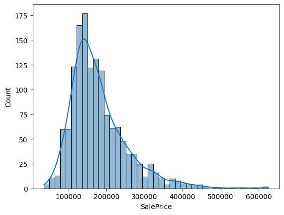
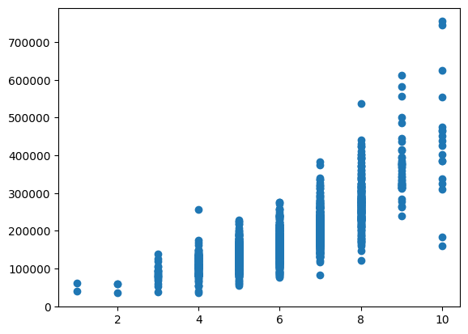
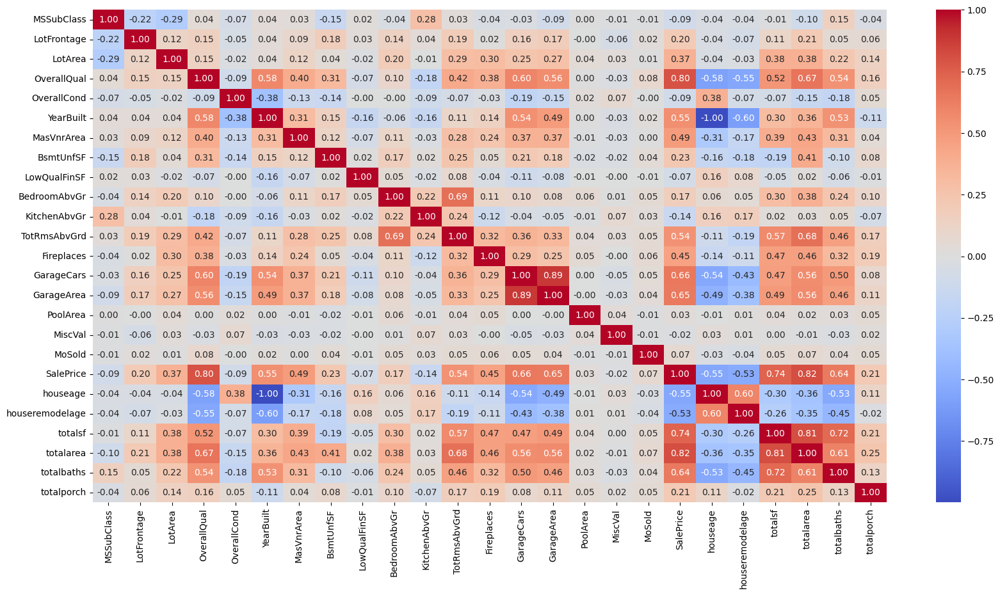
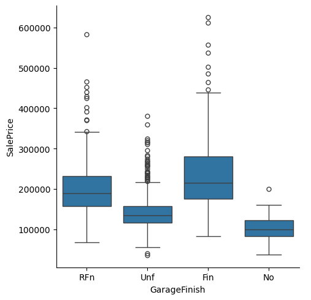
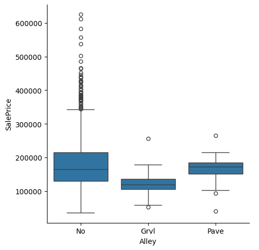

# House Price Analysis & Prediction

A machine learning project that explores residential property data and builds regression models to estimate house sale prices. The work is documented in the Jupyter Notebook `house_price_analysis.ipynb` and uses the **House Prices: Advanced Regression Techniques** dataset from Kaggle.

## Project Overview

The project investigates how property characteristics relate to sale price, prepares the data for machine learning, engineers aggregated housing features, and compares several regression algorithms. It also combines tuned models using ensemble techniques and generates a prediction file for the competition test dataset.

**Problem type:** Supervised learning — regression  
**Target:** `SalePrice`  
**Dataset:** Kaggle House Prices: Advanced Regression Techniques

## Visual Analysis

The notebook contains several visualizations that help explain the data before modeling. The most useful ones are included below so the GitHub repository is easier to scan without opening the notebook first.

### 1. Sale Price Distribution

The target variable is strongly right-skewed, with most observations concentrated in the lower-to-middle price range and a smaller number of high-priced properties. This supports the notebook's use of a logarithmic transformation of `SalePrice` during modeling.



### 2. Overall Quality vs. Sale Price

The scatter plot shows a clear positive relationship between `OverallQual` and `SalePrice`: properties with higher overall quality generally have higher sale prices. The spread also increases at higher quality levels, showing that quality alone does not explain all price variation.



### 3. Correlation Heatmap

The correlation matrix provides a compact view of relationships among the numerical variables and the engineered features. In the notebook's data, `OverallQual`, `GrLivArea`, `GarageCars`, `GarageArea`, `totalarea`, and `totalsf` show notable positive relationships with `SalePrice`, while age-related features show negative relationships.



### 4. Categorical Feature Relationships

Box plots are used to compare sale-price distributions across categorical housing attributes. The examples below illustrate how garage configuration and alley access are associated with different price distributions in the analyzed dataset. These plots are descriptive relationships, not causal conclusions.





> **Repository note:** The images above are extracted directly from the executed notebook. Keep the `assets/` folder in the same directory as `README.md` so GitHub renders the images correctly.

## Workflow

1. **Load and inspect the data**
   - Load the training and test CSV files with pandas.
   - Inspect columns, data types, descriptive statistics, and missing-value counts.
   - Separate numerical and categorical features for analysis and preprocessing.

2. **Exploratory data analysis**
   - Use scatter plots to inspect the relationship between sale price and numerical property attributes.
   - Use box plots to explore sale-price distributions across selected categorical variables.
   - Inspect the target distribution and a numerical-feature correlation heatmap.

3. **Outlier investigation and filtering**
   - Review unusual observations in variables such as lot frontage, lot area, overall condition, construction year, basement area, living area, and garage area.
   - Use visual inspection, selected threshold queries, and z-scores (for `LotArea`) to identify potentially influential records.
   - Remove a manually selected set of training observations by `Id`.

   The notebook uses domain-informed, manually chosen rules rather than a single automated outlier detector. These exclusions should therefore be validated carefully, since unusual homes can be legitimate examples.

4. **Missing-value handling and feature selection**
   - Fill selected missing categorical values with labels such as `No`, `NA`, or the most plausible category used in the notebook.
   - Fill selected numeric fields with zero.
   - Remove several columns judged unnecessary for the subsequent modeling workflow.
   - Use separate imputation steps in the preprocessing pipeline for remaining missing values.

5. **Feature engineering**

   Create features intended to summarize related property measurements:
   - `houseage`: year sold minus year built.
   - `houseremodelage`: year sold minus year of the most recent remodel.
   - `totalsf`: sum of selected above-ground floor and finished-basement square-footage fields.
   - `totalarea`: above-ground living area plus total basement area.
   - `totalbaths`: full bathrooms plus half-weighted half bathrooms, including basement bathrooms.
   - `totalporch`: combined area of selected porch and screen-porch features.

   After creating these aggregate features, the notebook drops some of the component columns to reduce redundancy.

6. **Transform the target and encode features**
   - Apply `log1p` to `SalePrice` to reduce right skew.
   - Apply **ordinal encoding** to selected ordered categorical features.
   - Apply **one-hot encoding** to selected nominal categorical features.
   - Impute numerical values with the mean and standardize them with `StandardScaler`.
   - Use `ColumnTransformer` and scikit-learn `Pipeline` to organize preprocessing.

7. **Train and tune regression models**

   The notebook explores the following estimators:
   - Linear Regression
   - Random Forest Regressor
   - XGBoost Regressor
   - Ridge Regression
   - Gradient Boosting Regressor
   - LightGBM Regressor
   - CatBoost Regressor

   Hyperparameters are searched with `GridSearchCV`, using cross-validation and negative mean squared error as the scoring function. The notebook converts the best cross-validation score to RMSE for some model comparisons.

8. **Ensemble learning**
   - **Voting Regressor:** combines tuned Gradient Boosting, XGBoost, and Ridge models with weights `[2, 3, 1]`.
   - **Stacking Regressor:** uses tuned Gradient Boosting, XGBoost, CatBoost, LightGBM, and Random Forest estimators, with the voting regressor as the final estimator.

9. **Generate predictions**
   - Transform the competition test data with the preprocessing pipeline.
   - Predict in log-price space using the stacking model.
   - Apply the inverse transformation with `exp`.
   - Save the `Id` and predicted `SalePrice` columns to `HousePredictionStacking0608.csv`.

## Tools, Technologies & Libraries

| Tool / library | Role in the project |
|---|---|
| Python | Main programming language |
| Jupyter Notebook | Interactive analysis and experimentation |
| Kaggle House Prices dataset | Training and competition test data |
| pandas | CSV loading, tabular inspection, filtering, and feature engineering |
| NumPy | Numerical operations and target inverse transformation |
| Matplotlib | Scatter plots and other visualizations |
| Seaborn | Distribution plots, categorical plots, and correlation heatmap |
| SciPy (`stats`) | Z-score-based outlier inspection |
| scikit-learn | Preprocessing, pipelines, data splitting, regression, cross-validation, metrics, and ensembles |
| XGBoost | Gradient-boosted tree regression |
| LightGBM | Gradient-boosting framework and regressor |
| CatBoost | Gradient-boosting regressor |

The notebook also imports preprocessing utilities such as `SimpleImputer`, `StandardScaler`, `OrdinalEncoder`, `OneHotEncoder`, `ColumnTransformer`, and `Pipeline`.

## Algorithms and Evaluation

The task is regression, so the notebook uses **Mean Squared Error (MSE)** and **Root Mean Squared Error (RMSE)** rather than classification accuracy. Grid searches use negative MSE because scikit-learn's search interface maximizes scores.

The modeling strategy includes:
- Linear regression as a basic linear baseline.
- Ridge regression for L2-regularized linear modeling.
- Random forests and boosting algorithms to model nonlinear relationships and feature interactions.
- Voting and stacking to combine predictions from multiple estimators.

The notebook does not provide a consolidated results table or documented final metric values in its saved content. For that reason, this README does not claim a winning model, a particular RMSE, or a competition leaderboard score.

## Challenges Addressed

- **Mixed feature types:** numerical, nominal categorical, and ordinal categorical columns require different transformations. This is handled with separate pipelines inside a `ColumnTransformer`.
- **Missing data:** housing records contain missing values, including fields where missingness can mean that a feature is absent (for example, no garage or basement feature). The notebook uses explicit absence labels for selected columns and imputation for remaining gaps.
- **Influential observations:** some unusually large or high-priced properties can affect regression behavior. The notebook investigates these cases using plots, threshold queries, and z-scores before applying manual exclusions.
- **Skewed target distribution:** the sale-price target is right-skewed, so a logarithmic transformation is applied during training and reversed for final predictions.
- **Redundant measurements:** related square-footage, bathroom, and porch fields are aggregated into engineered features, after which selected source columns are removed.
- **Model selection and complexity:** several model families have different hyperparameters and behavior. Cross-validated grid search is used to tune them, and ensemble methods are explored to combine their predictions.
- **Consistent test processing:** the same preprocessing pipeline is applied to the competition test data before generating predictions.

## Repository Structure

```text
.
├── house_price_analysis.ipynb
├── README.md
├── assets/
│   ├── saleprice-distribution.png
│   ├── overall-quality-vs-saleprice.png
│   ├── correlation-heatmap.png
│   ├── garage-finish-vs-saleprice.png
│   └── alley-vs-saleprice.png
└── HousePredictionStacking0608.csv   # generated when the notebook is run
```

The CSV is an output artifact and may not be present in the repository unless it has been generated and committed.

## How to Run

1. Clone or download this repository.
2. Install Python and Jupyter Notebook.
3. Install the libraries used by the notebook. For example:

   ```bash
   pip install numpy pandas matplotlib seaborn scipy scikit-learn xgboost lightgbm catboost jupyter
   ```

4. Download the Kaggle **House Prices: Advanced Regression Techniques** data and place `train.csv` and `test.csv` where the notebook expects them, or update the file paths in the data-loading cell.
5. Open and run `house_price_analysis.ipynb` from top to bottom.

The notebook currently uses Kaggle-style input paths. Those paths will need to be changed when running outside the corresponding Kaggle environment.

## Notes and Potential Improvements

- Fit preprocessing **after** creating the train/validation split. In the current notebook, `pipeline.fit_transform(X)` occurs before `train_test_split`, meaning imputation and scaling statistics—and category discovery—are learned using the full labeled feature set before validation. A stricter evaluation would split first and fit transformations only on the training fold, ideally by cross-validating a complete preprocessing-plus-model pipeline.
- Review the manually removed outliers with validation experiments. Compare results with and without exclusions to ensure that genuine high-value properties are not discarded.
- Add a fixed random seed to all estimators and validation procedures where appropriate for reproducibility.
- Report a common validation metric table for all candidate models and ensembles.
- Consider using a log-target-aware metric and clearly state whether RMSE is measured in log space or original sale-price units.
- Add feature-importance or model-interpretation analysis to explain which housing attributes contribute most to predictions.
- Correct and document any feature-specific imputation assumptions, and verify that train and test preprocessing remain aligned.

## Summary

This project demonstrates an end-to-end tabular regression workflow: exploratory data analysis, outlier review, missing-value treatment, feature engineering, categorical encoding, numerical scaling, hyperparameter tuning, ensemble modeling, and prediction-file generation. It provides a practical foundation for further experimentation with housing-price prediction and more rigorous model validation.
